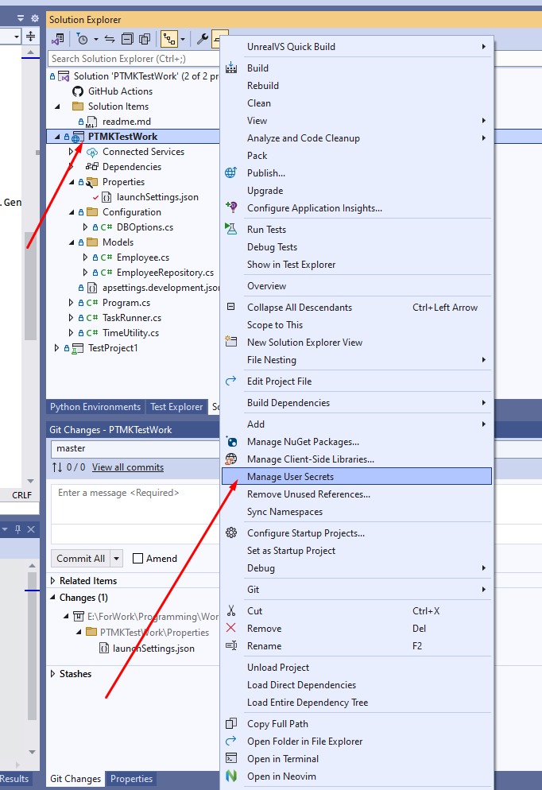

# Оптимизация
Неоптимизировнный запрос можно вызвать, используя аргумент `6` при запуске программы. Оптимизированный запрос выполняет фильтрацию на сервере sql, в то
время как неоптимизированный достает все записи из таблицы `Employee` и потом сортирует их в приложении. В общем у меня на машине оптимизированный запрос выполняется за 0.34 сек,
в то время как неоптимизированный где-то 3.5 сек.
# Запуск
Перед запуском необходимо поднять сервер MSSQL ([например через Docker](https://learn.microsoft.com/ru-ru/sql/linux/quickstart-install-connect-docker?view=sql-server-ver16&tabs=cli&pivots=cs1-bash#pullandrun2022)), и создать строку подключения в секретах для прилоежния. Как создать секреты написано [тут](https://learn.microsoft.com/en-us/aspnet/core/security/app-secrets?view=aspnetcore-8.0&tabs=windows).
Секрет должен быть вида `"DirectoryDB:ConnectionString": "Server=localhost,1433;Database=Employee-Directory;TrustServerCertificate=True;User Id=SA;Password=<YourStrong@Passw0rd>"`.
Также можно запустить тесты, которые находятся в проекте TestProject1.
# Использованные инструменты
Visual Studio 2022, MSSQL SERVER
